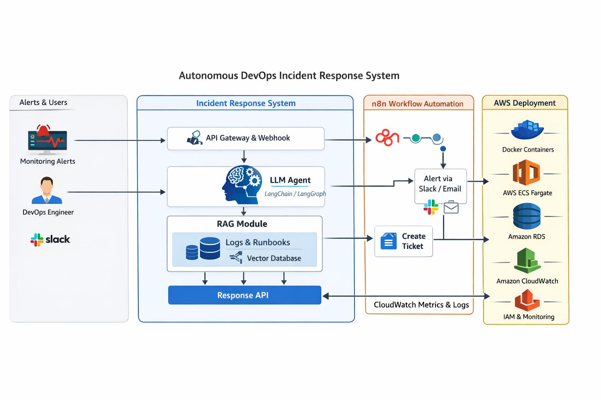

# Autonomous DevOps Incident Response Agent

[](https://github.com/OluwaTossin/autonomous-incident-response-agent/actions/workflows/ci.yml)

**AI-assisted incident triage** for people who run production systems: **RAG** over runbooks, incidents, and logs; a **LangGraph** pipeline with guardrails; **structured JSON** from **FastAPI**; **Next.js** triage console; optional **Gradio** and **n8n**; **Terraform** on **AWS** (ECS, ALB, ECR) when you deploy beyond your laptop.

**Maintainer:** Oluwatosin Jegede

---

## Table of contents

- [What this product does](#what-this-product-does)
- [Who it is for](#who-it-is-for)
- [Quick start](#quick-start)
- [Bring your own data](#bring-your-own-data)
- [Architecture](#architecture)
- [Features](#features)
- [Prerequisites](#prerequisites)
- [Documentation](#documentation)
- [Project status & branches](#project-status--branches)
- [Shipped milestones (summary)](#shipped-milestones-summary)
- [Repository layout](#repository-layout)
- [Development](#development)
- [Testing](#testing)
- [Docker Compose (product stack)](#docker-compose-product-stack)
- [Contributing](#contributing)
- [Disclaimer](#disclaimer)

---

## What this product does

You send **alert-style JSON**. The service **retrieves** relevant operational writing (runbooks, past incidents, logs), **reasons** with an LLM, and returns **structured triage**: summary, severity, hypothesis, recommended actions, escalation signal, and **evidence** you can audit. Optional hooks push outcomes into **Slack**-style flows or tickets via **n8n**.

**Shipped today:** end-to-end path from local dev through **AWS ECS**, **CloudWatch**, and **GitHub Actions** (milestones **1–14**). Per-phase evidence and checklists: **[`docs/build-journey/execution-v1.md`](docs/build-journey/execution-v1.md)**.

Deeper product framing: [`docs/decisions/capabilities-and-roadmap.md`](docs/decisions/capabilities-and-roadmap.md).

---

## Who it is for

- **SREs / DevOps / platform engineers** who want grounded first-pass triage, not a generic chatbot
- **Teams** already storing runbooks and incident writeups as files (Markdown, logs)
- **Builders** who need a reference layout for RAG + agents + IaC + CI/CD in one repo

---

## Quick start

```bash
uv sync --extra dev          # add --extra ui for Gradio at /ui
cp .env.example .env         # set OPENAI_API_KEY
uv run product-build-index --workspace default   # or `uv run rag-build` — index under workspaces/<id>/index/ unless RAG_INDEX_DIR is set
uv run serve-api             # http://127.0.0.1:8000/docs
```

| Command | Purpose |
|---------|---------|
| `uv run rag-build` / `rag-query` | Index + ad-hoc retrieval |
| `uv run product-validate-workspace` / `uv run product-build-index` | Workspace layout check + workspace-scoped index build (see [`docs/bring-your-own-data.md`](docs/bring-your-own-data.md)) |
| `uv run triage -f …` | One-shot triage CLI |
| `uv run serve-api` | FastAPI + OpenAPI |
| `uv run triage-eval` | Gold JSONL → report (~27 cases; live LLM) |

**Full stack (API + Next.js):** after `./scripts/product/rebuild-index.sh`, `./scripts/product/start.sh` — API **:18080**, UI **:3000**. Optional n8n: add `--profile automation`. See [Docker Compose (product stack)](#docker-compose-product-stack).

**Next.js console:** [`frontend/README.md`](frontend/README.md) — local dev defaults to `http://localhost:3000` against your API (set `NEXT_PUBLIC_API_BASE_URL` as documented there).

---

## Bring your own data

Operational knowledge lives under **`data/`** today:

| Path | Role |
|------|------|
| [`sample_data/default_demo/`](sample_data/default_demo/) | Bundled synthetic corpus (runbooks, incidents, logs, knowledge base) used when **`AIRA_DATA_MODE=demo`** and workspace `data/` is empty |
| [`workspaces/<WORKSPACE_ID>/data/`](workspaces/README.md) | Your operational files (same subfolder layout); primary when populated or in **`AIRA_DATA_MODE=user`** |
| [`data/eval/`](data/eval/) | Gold JSONL and eval reports (`uv run triage-eval`) |

After you add or change corpus files under **`workspaces/.../data/`** (or rely on **`sample_data/default_demo/`** in demo mode), run **`uv run rag-build`** or **`./scripts/product/rebuild-index.sh`** so the FAISS bundle under **`workspaces/<WORKSPACE_ID>/index/`** is refreshed (gitignored), unless **`RAG_INDEX_DIR`** points elsewhere. See **[`docs/bring-your-own-data.md`](docs/bring-your-own-data.md)** · [`workspaces/README.md`](workspaces/README.md) · [`data/README.md`](data/README.md) · [`sample_data/README.md`](sample_data/README.md).

> **Note:** The repository ships a **synthetic** sample corpus for demos and eval — not live production data (see [Disclaimer](#disclaimer)).

---

## Architecture



Layered diagrams, sequence views, and CI/CD detail (Mermaid): **[`docs/architecture/system-architecture.md`](docs/architecture/system-architecture.md)** · index [`docs/architecture/README.md`](docs/architecture/README.md)

---

## Features

- **RAG** — FAISS index over workspace or bundled `sample_data/default_demo/` corpus (`uv run rag-build`; `AIRA_DATA_MODE`)
- **Agent** — LangGraph pipeline: normalize → retrieve → analyze → enrich → decide → format
- **API** — FastAPI: `POST /triage`, `POST /ingest-incident`, OpenAPI at `/docs`, optional `API_KEY` + rate limits
- **Audit & feedback** — JSONL audit; `triage_id` for joins; n8n + Gradio feedback paths
- **UIs** — Gradio at `/ui`; Next.js triage console in [`frontend/`](frontend/) (static export → S3 when deployed)
- **Automation** — n8n workflows (Slack, mock Jira) — [`workflows/n8n/`](workflows/n8n/)
- **Eval** — Gold set + `uv run triage-eval` — [`data/eval/`](data/eval/)
- **AWS** — Terraform **dev/prod**, ECS Fargate, ALB, ECR, SSM secrets, optional static UI CDN
- **Observability** — CloudWatch dashboard, triage log metrics, alarms — [`docs/deploy/observability.md`](docs/deploy/observability.md)
- **CI/CD** — GitHub Actions (lint, tests, Terraform validate, frontend + Docker builds) — [`docs/deploy/ci.md`](docs/deploy/ci.md)

---

## Prerequisites

| Requirement | Notes |
|-------------|--------|
| **Python** | 3.11+ (see [`pyproject.toml`](pyproject.toml)) |
| **uv** | [Install uv](https://docs.astral.sh/uv/) — package manager and virtualenv |
| **OpenAI (or compatible)** | `OPENAI_API_KEY` in `.env` for embeddings + chat |
| **Docker** | Optional; for Compose (API + n8n) and local n8n |
| **AWS CLI / Terraform** | For deploy paths — see deploy docs |

Copy [`.env.example`](.env.example) → **`.env`**. Only **`.env`** is loaded by the app (never commit secrets).

---

## Documentation

| Topic | Link |
|-------|------|
| Architecture (Mermaid diagrams, PNG exports) | [`docs/architecture/system-architecture.md`](docs/architecture/system-architecture.md) |
| **Version 1 build log** (phases 1–14, milestones, closure) | [`docs/build-journey/execution-v1.md`](docs/build-journey/execution-v1.md) |
| Build journey index | [`docs/build-journey/README.md`](docs/build-journey/README.md) |
| Branches (`dev` / `main`), GitHub secrets | [`docs/contributing.md`](docs/contributing.md) |
| Deploy API to ECS / ECR / SSM | [`docs/deploy/aws-ecs.md`](docs/deploy/aws-ecs.md) |
| CloudWatch dashboard & triage metrics | [`docs/deploy/observability.md`](docs/deploy/observability.md) |
| GitHub Actions CI & optional deploy | [`docs/deploy/ci.md`](docs/deploy/ci.md) |
| Terraform layout & remote state | [`infra/terraform/README.md`](infra/terraform/README.md) |
| n8n workflows & webhooks | [`workflows/n8n/README.md`](workflows/n8n/README.md) |
| Next.js triage UI | [`frontend/README.md`](frontend/README.md) |
| Pre-cloud validation | [`docs/validation/pre-cloud-validation.md`](docs/validation/pre-cloud-validation.md) |
| Problem definition / ADRs | [`docs/decisions/`](docs/decisions/) |
| Data corpus layout | [`data/README.md`](data/README.md) |

---

## Project status & branches

- **Shipped:** Milestones **1–14** (see [Shipped milestones (summary)](#shipped-milestones-summary) and [`docs/build-journey/execution-v1.md`](docs/build-journey/execution-v1.md)).
- **Workflow:** develop on **`dev`**, promote via **PR → `main`** — [`docs/contributing.md`](docs/contributing.md).
- **Backlog:** TLS, Phase 15 ideas, deeper n8n metrics — tracked in [`docs/build-journey/execution-v1.md`](docs/build-journey/execution-v1.md), not part of the current closure.

---

## Shipped milestones (summary)

| Phase | Status | Primary artifacts |
|-------|--------|-------------------|
| **1** — Problem definition | Done | [`docs/decisions/problem-definition.md`](docs/decisions/problem-definition.md) |
| **2** — Knowledge & sample data | Done | [`sample_data/default_demo/`](sample_data/default_demo/) (bundled corpus); [`data/eval/`](data/eval/) |
| **3** — Local RAG | Done | [`app/rag/`](app/rag/) · `.rag_index/` (gitignored) |
| **4** — LangGraph agent | Done | [`app/agent/`](app/agent/), [`app/models/`](app/models/) |
| **5** — HTTP API | Done | [`app/api/`](app/api/) |
| **6** — n8n | Done | [`workflows/n8n/`](workflows/n8n/), [`docker-compose.n8n.yml`](docker-compose.n8n.yml) |
| **7** — Gradio UI | Done | [`app/ui/`](app/ui/) · `/ui` |
| **8** — Evaluation | Done | [`app/eval/`](app/eval/), [`data/eval/gold.jsonl`](data/eval/gold.jsonl) |
| **9** — Docker Compose | Done | [`Dockerfile`](Dockerfile), [`docker-compose.yml`](docker-compose.yml) |
| **10** — Terraform | Done | [`infra/terraform/`](infra/terraform/) |
| **11** — ECS / ECR | Done | [`docs/deploy/aws-ecs.md`](docs/deploy/aws-ecs.md), [`scripts/aws/push_api_to_ecr.sh`](scripts/aws/push_api_to_ecr.sh) |
| **12** — Next.js UI | Done | [`frontend/`](frontend/), [`scripts/aws/deploy_frontend_cdn.sh`](scripts/aws/deploy_frontend_cdn.sh) |
| **13** — Observability | Done | [`docs/deploy/observability.md`](docs/deploy/observability.md), [`infra/terraform/modules/monitoring/`](infra/terraform/modules/monitoring/) |
| **14** — CI/CD | Done | [`.github/workflows/ci.yml`](.github/workflows/ci.yml), [`docs/deploy/ci.md`](docs/deploy/ci.md) |

**Per-phase narrative** (endpoints, env vars, n8n behaviour, AWS steps): **[`docs/build-journey/execution-v1.md`](docs/build-journey/execution-v1.md)** — full spec lives there so this file stays scannable.

---

## Repository layout

| Path | Purpose |
|------|---------|
| [`docs/build-journey/execution-v1.md`](docs/build-journey/execution-v1.md) | Version 1 phased build log, milestones, evidence |
| [`sample_data/README.md`](sample_data/README.md) | Bundled demo corpus (`AIRA_DATA_MODE`) |
| [`docs/contributing.md`](docs/contributing.md) | Branching & GitHub Actions secrets |
| [`docs/decisions/`](docs/decisions/) | ADRs, problem definition, roadmap |
| [`docs/architecture/`](docs/architecture/) | [`system-architecture.md`](docs/architecture/system-architecture.md), diagrams; overview PNG at repo root [`architectural-diagram.png`](architectural-diagram.png) |
| [`app/`](app/) | `rag`, `agent`, `api`, `models`, `ui`, `eval` |
| [`data/`](data/) | Eval gold set, runtime JSONL logs; bundled corpus → [`sample_data/default_demo/`](sample_data/default_demo/) |
| [`frontend/`](frontend/) | Next.js triage console |
| [`workflows/n8n/`](workflows/n8n/) | Importable n8n JSON + README |
| [`infra/terraform/`](infra/terraform/) | Modules, `envs/dev`, `envs/prod`, bootstrap |
| [`scripts/`](scripts/) | E2E check, benchmarks, AWS helpers, [`scripts/product/`](scripts/product/) (Compose + index) |
| [`examples/sample_incident_payload.json`](examples/sample_incident_payload.json) | Sample payload for CLI / API |

---

## Development

Uses **[uv](https://docs.astral.sh/uv/)** with [`pyproject.toml`](pyproject.toml) and [`uv.lock`](uv.lock).

```bash
curl -LsSf https://astral.sh/uv/install.sh | sh   # or: brew install uv
cd autonomous-incident-response-agent
uv sync --extra dev
```

**Triage CLI** (needs `.env`, index, chat model):

```bash
uv run triage -f examples/sample_incident_payload.json
```

**API** (same environment):

```bash
uv run serve-api
curl -s http://127.0.0.1:8000/health
curl -s -X POST http://127.0.0.1:8000/triage -H "Content-Type: application/json" \
  -d @examples/sample_incident_payload.json
```

With **`API_KEY`** set on the server, add header `x-api-key: <value>`. OpenAPI: `/docs`.

**Gradio:** `uv sync --extra ui` then `uv run serve-api` → `http://127.0.0.1:8000/ui` (Compose default API port is **18080**).

**Eval:** `uv run triage-eval` — optional `--limit N`, `--out path/to/report.md`.

**Lockfile:** after editing dependencies, `uv lock`. [`requirements.txt`](requirements.txt) is optional; prefer **`uv sync`**.

If `POST /triage` returns 404, confirm nothing else is bound to the port: `curl -s http://127.0.0.1:8000/` should show this service’s discovery JSON.

---

## Testing

```bash
uv sync --extra dev
uv run pytest
```

Layout: `tests/unit/`, `tests/integration/` (integration mocks the LLM where appropriate).

---

## Docker Compose (product stack)

**Default stack** (API + Next.js static operator UI): **n8n is not started** unless you opt in with the Compose **`automation`** profile.

```bash
uv run product-build-index --workspace default   # or: ./scripts/product/rebuild-index.sh
./scripts/product/start.sh                       # same as: docker compose up -d --build
```

- **API (OpenAPI / Gradio):** `http://127.0.0.1:18080/docs` and `http://127.0.0.1:18080/ui` (override host port with `COMPOSE_API_PORT`).
- **Next.js (static export via nginx):** `http://127.0.0.1:3000/` (`COMPOSE_UI_PORT` to change). The UI is built with `NEXT_PUBLIC_API_BASE_URL` pointing at that API port so the **browser** can reach the API from your machine.
- **n8n (optional):** `docker compose --profile automation up -d --build` — then `http://127.0.0.1:5678/`. Same profile as [`./scripts/product/start.sh`](scripts/product/start.sh) when you pass `--profile automation`.

**Volumes:** `./workspaces` (corpus + index per `WORKSPACE_ID`) and `./data` (legacy corpus + logs) are bind-mounted into the API container. **Security:** the API listens on `0.0.0.0` **inside** the container so port publishing works; only publish `COMPOSE_API_PORT` / `COMPOSE_UI_PORT` on interfaces you trust. Do not expose **`ADMIN_API_KEY`**-protected routes (when implemented) to the public internet without TLS and a reverse proxy — see product notes in [`docs/bring-your-own-data.md`](docs/bring-your-own-data.md).

**Helper scripts:** [`scripts/product/start.sh`](scripts/product/start.sh), [`rebuild-index.sh`](scripts/product/rebuild-index.sh), [`reset.sh`](scripts/product/reset.sh) (index wipe only; requires typing `DELETE`).

**E2E smoke:** [`scripts/e2e_stack_check.sh`](scripts/e2e_stack_check.sh) — without n8n use `SKIP_N8N=1` (n8n is off unless `--profile automation`).

**n8n only** (API on host): `docker compose -f docker-compose.n8n.yml up -d` — full guide: [`workflows/n8n/README.md`](workflows/n8n/README.md).

**AWS image:** `.rag_index` is baked in the root `Dockerfile` for ECS; local Compose prefers **`workspaces/<id>/index/`** when `RAG_INDEX_DIR` is unset. Run [`scripts/product/rebuild-index.sh`](scripts/product/rebuild-index.sh) before `docker compose` if that directory is empty. Rollout: [`scripts/aws/push_api_to_ecr.sh`](scripts/aws/push_api_to_ecr.sh) and [`docs/deploy/aws-ecs.md`](docs/deploy/aws-ecs.md).

---

## Contributing

Branch **`dev`**, open PRs to **`main`**. CI expectations and optional secrets: [`docs/contributing.md`](docs/contributing.md).

---

## Disclaimer

Runbooks, incidents, and logs in this repository are **synthetic** training and evaluation material. They are not live production data.
