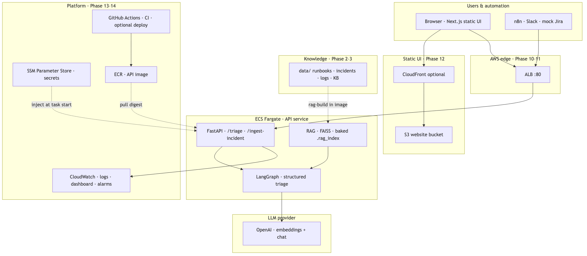
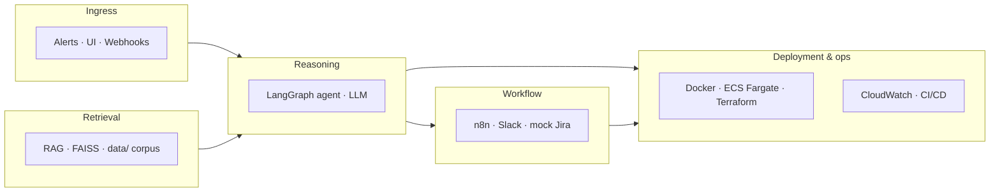
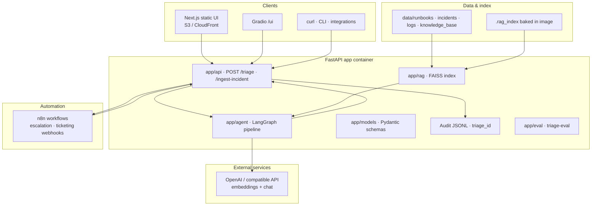
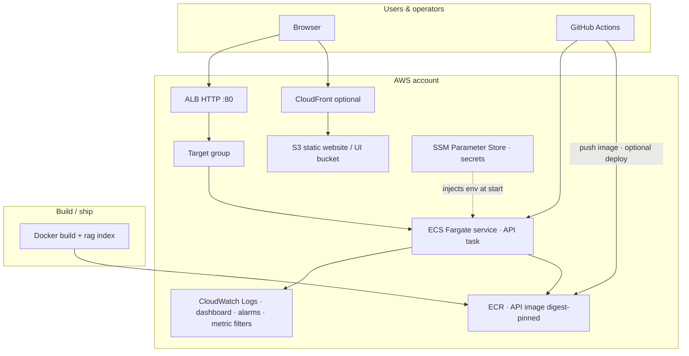
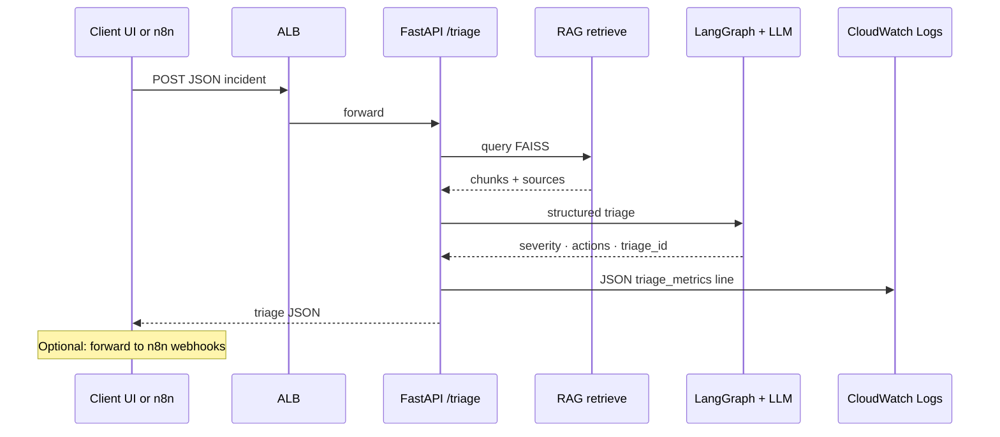
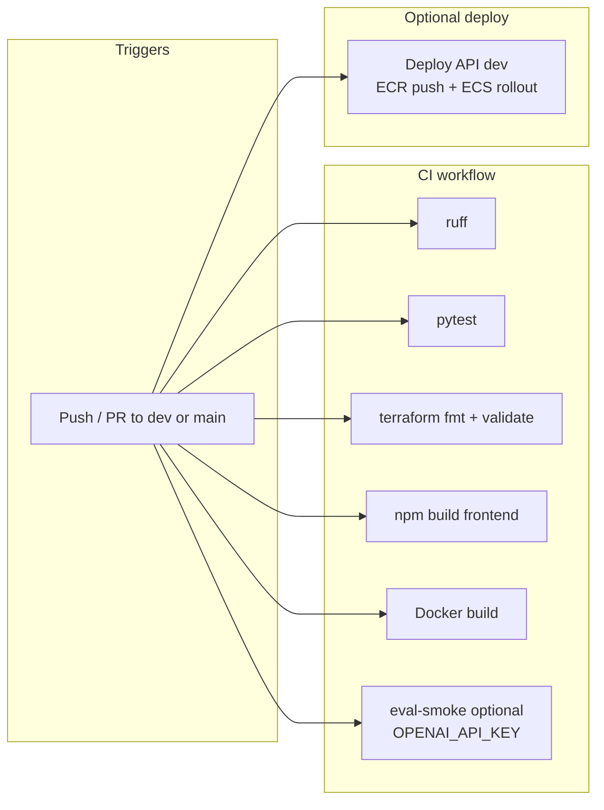

# System architecture

End-to-end view of the **Autonomous DevOps Incident Response Agent** as implemented through **Phases 1–14**: triage API, RAG, LangGraph, n8n, AWS (ECS, ALB, ECR, SSM), static UI, CloudWatch, and GitHub Actions.

## Single overview (PNG)

Exported from **[`architecture-overview.mmd`](architecture-overview.mmd)** (regenerate: `npx @mermaid-js/mermaid-cli -i architecture-overview.mmd -o architecture-overview.png` from this folder).

---

Detailed breakdowns below: open this file in **GitHub** or **Cursor** (Mermaid preview), or paste blocks into [mermaid.live](https://mermaid.live) for SVG/PNG variants.

---

## 1. Five layers (product view)

Maps to the phased build in [`execution.md`](../../execution.md).

---

## 2. Logical components (runtime)

---

## 3. AWS topology (dev / prod)

---

## 4. Triage request flow (happy path)

---

## 5. CI / CD (GitHub Actions)

---

## Repo map (quick reference)

| Area | Path |
|------|------|
| API & agent | `app/api/`, `app/agent/`, `app/models/` |
| RAG | `app/rag/`, corpora under `data/` |
| UIs | `app/ui/`, `frontend/` |
| n8n | `workflows/n8n/` |
| IaC | `infra/terraform/` · `envs/dev` · `envs/prod` · `bootstrap/` |
| Deploy scripts | `scripts/aws/push_api_to_ecr.sh`, `deploy_frontend_cdn.sh` |
| Workflows | `.github/workflows/ci.yml`, `deploy-dev.yml` |

---

**Maintainer:** Oluwatosin Jegede
