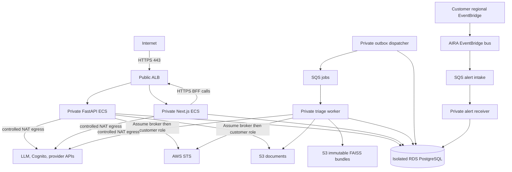

# Version 3 Hosted AWS Platform

## Topology And Trust Boundaries

Only the ALB and NAT gateways occupy public subnets. Web, API, worker, dispatcher, and
alert receiver tasks use private application subnets with no public IP. PostgreSQL uses
isolated database subnets with no default internet route. Security-group references, not
public CIDRs, permit ALB-to-task and task-to-database traffic.

HTTP exists only to redirect to HTTPS. ACM DNS validation and Route 53 aliases establish
the public web and API names. Host-based ALB routing keeps web and API independently
deployable. The browser uses the Next.js BFF; FastAPI CORS is not opened to arbitrary
origins. Uvicorn trusts forwarded headers only from the configured VPC range, while
callback URLs use the configured public origin.

## Availability And Egress

Production uses two AZs, per-AZ NAT gateways, Multi-AZ RDS, and at least two API and web
tasks. Development uses two subnet sets but one NAT gateway and single-AZ RDS to contain
cost. This closes the deferred NAT decision; changing it requires an explicit environment
configuration change.

NAT remains required for external LLMs and public Cognito/provider endpoints. An S3
gateway endpoint is always enabled. Production also enables ECR API/DKR, CloudWatch Logs,
Secrets Manager, SQS, and STS interface endpoints. Their recurring cost must be compared
with NAT traffic during later operational measurement; they do not eliminate NAT.

## Runtime And Data

API, worker, dispatcher, alert receiver, and migration use the hardened hosted Python
build; API, worker, and web images are digest-pinned in separate immutable ECR
repositories. Hosted web uses its standalone, non-root Next.js build. Task filesystems are
read-only; worker gets a bounded ephemeral mount for its verified FAISS cache.

Hosted service activation fails closed behind `enable_runtime_services`. The initial
infrastructure apply leaves all services at desired count zero so repositories can be
populated and secrets configured. A second disabled-runtime apply registers real image
digests, the one-off migration runs, and only a final reviewed apply enables services.

RDS PostgreSQL is encrypted, private, backed up, and exports PostgreSQL logs. Production
enables deletion protection, 30-day backups, enhanced monitoring, Performance Insights,
and Multi-AZ. Direct bounded SQLAlchemy pools are the initial connection strategy. RDS
Proxy is deferred until connection/load measurements justify it.

The RDS-managed master credential is migration-only. A one-off ECS migration task reads
it, creates or rotates `aira_app`, and runs Alembic. Runtime tasks receive a separate URL
for `aira_app`; that role remains a non-owner with `NOBYPASSRLS`. Runtime URLs require
`sslmode=require`. Application tasks never receive the migration credential.

Document and knowledge buckets are separate, private, versioned, KMS encrypted, TLS-only,
and block public access. Operational CloudWatch context remains incident evidence and is
not written to either knowledge corpus. Job and alert queues have separate encrypted DLQs.
PostgreSQL remains lifecycle authority; queue retries are transport only.

## Identity And Secrets

Cognito uses Authorization Code Flow with PKCE, a public client with no client secret,
verified email, code flow only, and production MFA. Web tokens remain in encrypted
PostgreSQL sessions referenced by Secure, HttpOnly cookies.

Cognito access tokens authorize API calls but may omit email/name on first sign-in. During
the server-only bootstrap call, Next.js additionally sends the ID token. FastAPI verifies
both signatures and token uses and requires the same issuer and subject before using ID
token profile claims. The ID token is never a tenant or role authority.

Secrets Manager containers are created for Python and Node runtime DB URLs, the LLM
provider key, web session key, and worker/alert routes. Both DB URLs use `aira_app`; the
separate formats avoid leaking driver-specific URLs between runtimes. Terraform never
creates secret versions or outputs secret values. Worker route configuration is
deployment-owned and fail-closed; it binds an
AWS account/region to one persisted integration and exact organization/workspace scope.

## AWS Integration Boundary

CloudWatch alarms are regional. The customer module is instantiated in every configured
region and forwards alarm state changes to the central AIRA event bus. The bus policy
allowlists customer account principals. A central rule sends events to a dedicated alert
SQS queue with retries and a distinct DLQ.

The receiver matches the EventBridge-generated account and region against an
operator-controlled route, then passes the persisted integration ID and exact tenant scope
to the existing ingestion service. That service revalidates account, region, integration
state, authorization, and deduplication. Duplicate account/region routes are rejected at
startup. The initial constraint is one active AIRA route per AWS account and region; more
flexible routing requires a durable platform routing registry, never payload authority.

API and worker roles can assume only a stable AIRA customer-assumer role. The application
first assumes that broker; customer trust policies name its stable ARN and ExternalId.
The broker can assume only customer role paths matching the configured `aira-read/`
prefix. No task role has customer mutation permissions, and no execution-intent code is
wired to a provider mutation API.

## IAM And Network Review

Intentional wildcard resources are limited to:

- `ecr:GetAuthorizationToken`, which AWS does not support per repository;
- KMS key-policy account administration and CloudWatch Logs statements, where `*` is
  scoped to the key containing the policy;
- the broker's cross-account `aira-read/` role path, because customer account IDs are
  tenant-configured. ExternalId and persisted account verification are independent checks.

There are no task-role action wildcards and no `AdministratorAccess`. Public IPv4 rules
are ALB ports 80/443 and private-task HTTPS egress through NAT. The public route table's
`0.0.0.0/0` points to the internet gateway; private application routes point to NAT. RDS
has no public route or address. No IPv6 public rule is configured.

## Cost And Deferred Work

Material recurring costs are NAT gateways/data processing, RDS/Multi-AZ storage and
backups, ECS/Fargate, ALB, interface endpoints, CloudWatch Logs, KMS requests, S3, and SQS.
Dev sizing lowers capacity but does not remove encryption or isolation.

V3.23 owns tenant-aware traces, bounded metric dimensions, dashboards, and measured SLO
thresholds. V3.25 owns broader hardening/scanning policy. V3.26 owns deployment
automation. V3.29 owns restore, failover, load, egress, and production smoke rehearsals.
V4 remains the boundary for actual remediation execution.

Terraform has not been applied by V3.22. No live AWS resource was created or changed.
