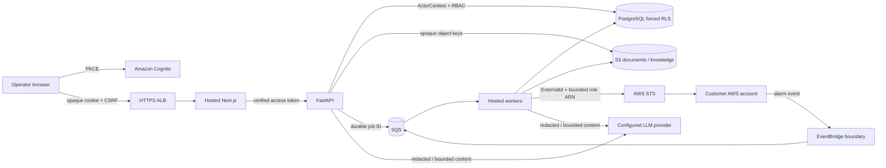

# Version 3 security hardening baseline

## Scope and release posture

This document is the V3.25 pre-production security baseline. It records controls that are
implemented and locally testable, findings that remain open, and explicit release gates. It is
not a compliance certification or evidence of an external penetration test. V3.25 made no live
AWS changes.

The hosted platform is fail-closed by default: no authenticated tenant context means no tenant
rows, no membership means no workspace authorization, no authoritative AWS target means no
execution intent, and no valid human approval means no consequential action preparation.

## Threat model

### Protected assets

- Incidents, evidence, CloudWatch context, documents, and workspace knowledge bundles.
- Memberships, roles, grants, service accounts, usage, quotas, and audit history.
- Browser sessions, Cognito tokens, database credentials, provider keys, ExternalIds, and AWS
  integration metadata.
- Action proposals, human approvals, and immutable execution intents.

### Trust boundaries

1. The browser holds only an opaque cookie and CSRF token; OAuth credentials remain in the
   server-side Next.js session store.
2. Cognito proves human identity. AIRA membership/RBAC, not JWT workspace claims, authorizes
   organization and workspace access.
3. The API and workers apply transaction-local tenant settings. PostgreSQL forced RLS is an
   independent isolation boundary.
4. S3 object keys are server-generated and bound to authorized database records. SQS messages
   are references to durable jobs, not authorization grants.
5. The AIRA broker role may assume only configured customer role paths. Customer trust must bind
   the AIRA principal and per-integration ExternalId.
6. Customer documents, logs, metrics, alerts, and LLM output are untrusted content. They cannot
   select connectors or execute infrastructure changes.
7. HTTPS ALB ingress is public; hosted tasks and RDS are private. Provider access uses controlled
   NAT egress and selected VPC endpoints.
8. Source, lockfiles, GitHub Actions, images, Terraform, and migration artifacts form the software
   supply-chain boundary.

## Security control matrix

| Threat | Control and location | Evidence | Residual risk / owner |
| --- | --- | --- | --- |
| Forged Cognito identity | JWT signature, issuer, audience/client, token use, expiry, algorithm allowlist, nonce, PKCE, and ID/access `sub` binding in `app/auth/oidc.py` and `web/src/lib/oidc.ts` | OIDC unit tests | Cognito availability and key rotation remain provider dependencies |
| Session theft/replay | Random opaque IDs, SHA-256 storage, AES-256-GCM server payload, inactivity/absolute expiry, durable revocation, refresh CAS | Hosted web session tests | Multi-key overlap rotation and global session revocation UI are deferred |
| CSRF | Origin plus constant-time CSRF token checks on BFF mutations; SameSite cookies are defense in depth | BFF/CSRF tests | Review every new mutation route in V3.26 CI |
| XSS/clickjacking | React escaping, no hosted `dangerouslySetInnerHTML`, CSP, frame denial, MIME sniffing and referrer policy | Header tests and source review | CSP retains `unsafe-inline` for current Next.js runtime |
| Open redirect | Return paths accept only decoded `/app` paths; logout redirect must equal configured app origin | `security.test.ts` | Provider-side callback allowlist remains required |
| SSRF/IMDS | Hosted outbound config rejects non-HTTPS, userinfo, nonstandard ports, localhost, and non-global IP literals, including `169.254.169.254` | Python and TypeScript SSRF tests | DNS rebinding and broad NAT egress require network/DNS controls before production |
| SQL injection | SQLAlchemy expressions and bound SQL parameters; no tenant input is interpolated into SQL | Source review and injection-shaped tests | New raw SQL requires review |
| IDOR/authorization bypass | Per-route ActorContext plus centralized RBAC and object lookup inside authorized scope | Authorization/API tests | V3.28 adversarial substitution suite is still release-blocking |
| Cross-tenant database access | Non-owner/NOBYPASSRLS runtime role, transaction-local context, forced RLS and policy on every metadata-derived tenant table | PostgreSQL inventory and pool-reuse tests | Requires PostgreSQL-enabled test environment in release CI |
| Audit/usage tampering | Runtime role has only SELECT/INSERT on append-only audit and usage ledgers | Migration and privilege test | No cryptographic hash chain; database owner remains trusted |
| Presigned URL abuse | Opaque server keys, short TTL, method/content type/size/checksum/KMS headers, final HEAD verification | Document storage tests | Malware scanning and full content sniffing are absent |
| Queue forgery/replay | IAM-bound queues, EventBridge source restriction, durable job identity, generation/lease/idempotency checks, DLQs | Job and alert ingestion tests | Live cross-account delivery validation remains deferred |
| AWS confused deputy | Exact account/region integration route, explicit role ARN, random ExternalId, broker role path scope | AWS integration tests and Terraform review | Customer trust-policy mistakes remain onboarding risk |
| Approval substitution | Human actor only; approval binds proposal hash; intent binds approval and proposal hashes; deterministic connector mapping | Approval/intent tests | Actual remediation execution is Version 4 |
| Secret exposure | Secrets Manager/KMS, per-process ECS execution roles, structured redaction, no browser OAuth token access | Terraform/static and redaction tests | Automated secret rotation is not yet implemented |
| Container escalation | Non-root UID 10001, read-only root, all Linux capabilities dropped, bounded writable cache | Terraform tests and image review | Runtime image CVEs require every release scan |
| Supply-chain substitution | Lockfiles, pinned Action SHAs, pinned image digests, immutable ECR tags and digest task references | Static tests | Pin refresh is a reviewed maintenance task |
| Resource abuse | Request/upload/query limits, bounded context collection, durable quotas and concurrency counters | API/quota tests | No WAF and no dedicated distributed login limiter yet |

## Authentication and browser policy

- Cognito Authorization Code Flow with PKCE is the only hosted human login path.
- ID tokens establish profile identity only. Access tokens authorize API authentication. Their
  subjects must match during callback.
- AIRA roles come from fresh membership and workspace-grant state, never Cognito role claims.
- Production session cookies default to `__Host-aira_session` and must retain the `__Host-`
  prefix, Secure, HttpOnly, SameSite=Lax, Path=/, and no Domain attribute.
- OAuth transaction cookies are short-lived, HttpOnly, Secure in production, SameSite=Lax, and
  scoped to `/auth`. OAuth transaction IDs are never reused as session IDs.
- Logout revokes the durable session before deleting the browser cookie. Refresh failure revokes
  the session. Membership revocation takes effect at the API authorization boundary.
- Session payload encryption uses Node crypto AES-256-GCM with random 96-bit IVs. Key rotation
  currently invalidates existing sessions; overlap rotation is a deferred implementation item.
- Consequential approvals require a human actor. Normal session freshness is not represented as
  MFA step-up; true step-up remains deferred.

Hosted authenticated pages, BFF responses, login callbacks, and errors use `private, no-store`.
The application origin is configured and is not derived from Host or forwarded-host headers.
Uvicorn trusts proxy headers only from the configured private proxy range.

## Tenant and actor isolation

Every SQLAlchemy table with `organization_id`, plus `organizations`, is treated as tenant-owned by
the RLS inventory test. The test reads `pg_class` and `pg_policies` and requires enabled and forced
RLS with at least one policy. This catches a future model whose migration omitted RLS without
maintaining a second table list by hand.

The migration role owns schema changes. `aira_app` is non-superuser, non-owner, cannot create in
`public`, and has no BYPASSRLS. Tenant identity is transaction-local and pool reuse is tested.
Human, service-account, and system actors remain distinct. Service accounts cannot use human-only
approval paths.

## AWS and infrastructure baseline

- API, web, worker, dispatcher, alert ingestion, and migration each have a dedicated ECS execution
  role with only their own secrets and log group. Dispatcher, alert ingestion, and migration also
  have dedicated task roles.
- Only the account-root KMS administration statement, CloudWatch Logs key-policy statement, and
  ECR authorization token action retain reviewed `Resource = "*"` semantics. There is no
  `iam:PassRole` grant.
- ALB ports 80/443 are the only public ingress. Port 80 only redirects to HTTPS. Tasks have no
  public IP and RDS is private. Broad HTTPS task egress remains because Cognito, LLM providers,
  and AWS APIs are external; VPC endpoints reduce AWS traffic where configured.
- RDS is encrypted and uses `rds.force_ssl=1`; hosted runtime URLs must use
  `sslmode=verify-full`. Production settings require Multi-AZ, deletion protection, backups, and
  enhanced monitoring through environment configuration.
- S3 blocks public access, enforces bucket-owner ownership, TLS, KMS encryption, and versioning.
  Uploads bind checksum, expected size/type, object key, and encryption headers.
- SQS uses KMS, bounded visibility/retention, DLQs, and redrive allow policies. EventBridge targets
  only the alert queue under source constraints.
- Cognito uses exact callback/logout URLs, authorization-code flow, token revocation, and MFA in
  production.

## Data handling and privacy

Restricted data includes credentials, OAuth/session material, customer logs/documents, incident
evidence, AWS identifiers, approvals, and intents. Logs and traces carry identifiers for
correlation but must not contain raw credentials or unbounded customer payloads. Customer
CloudWatch context is redacted, bounded, normalized, then persisted; it never becomes workspace
RAG knowledge automatically.

Retention markers are authoritative and historical evidence required for reproducibility is not
silently deleted. Authorized document deletion exists and records object cleanup state. Tenant-wide
export and organization erasure remain unavailable rather than bypassing authorization or audit;
their design and destructive verification are release-readiness work. There is no standing support
role or RLS bypass for normal operations. Any migration-owner support access is exceptional,
time-bounded, approved, and audited.

Uploaded hosted documents are limited to the explicit text/runbook formats, safe filenames, known
media types, and 5 MiB by default. Browser-selected object keys and archive extraction are not
supported. Checksums and object metadata are verified before finalization. There is no malware
scanner or full DLP/content-sniffing service yet, so production upload enablement requires an
accepted risk or an added quarantine scanner.

Documents, logs, alerts, retrieval text, and LLM output are untrusted prompt content. They cannot
alter ActorContext, RBAC, tenant context, approval state, connector selection, or target authority.
Structured Pydantic/domain validation and deterministic policy code guard every downstream action.
External-provider retention and training behavior depend on the selected provider contract.

## Security tooling and patch policy

Run `bash scripts/security/run-local-scans.sh` from a trusted workstation with native `gitleaks`,
`trivy`, and `syft` installed. The script pins pip-audit 2.10.1, Bandit 1.9.4, and Checkov 3.3.19,
runs both npm production audits, performs secret/IaC/filesystem scans, and writes the SBOM only to
a temporary directory. Generated SBOMs and scanner caches are not committed.

Patch findings individually. Confirm reachability and severity, update only affected packages,
regenerate the lockfile, run regressions, and rerun the scanner. Do not use `npm audit fix --force`
or unconstrained bulk Python upgrades. Critical/high findings block release unless a named owner,
expiry, compensating control, and explicit acceptance are recorded.

V3.25 scan evidence:

- pip-audit 2.10.1 initially found 44 advisory records in 11 packages. Reviewed fixed-version
  floors were applied; the repeat hosted-runtime lock audit reports no known vulnerabilities.
- `npm audit --omit=dev` reports zero vulnerabilities for both hosted web and the retained V2
  frontend after targeted, lockfile-reviewed updates.
- Bandit 1.9.4 found no high issues. Three low security-sensitive asserts were replaced with
  runtime fail-closed checks. Remaining findings are reviewed false positives or intentional
  bindings: JWT token-use strings, public container listen address, and the dedicated mounted
  `/tmp/aira-faiss-cache`.
- Checkov 3.3.19: 517 passed, 44 failed. Repeated findings cover security-group descriptions,
  one-year retention, secret rotation, S3 logging/replication/notifications, KMS/ECR wildcards,
  RDS IAM auth/enhanced monitoring, variable-driven dev/prod RDS and ALB protections, the default
  security group, VPC flow logs, WAF, the public HTTP redirect listener, and internal ALB-to-task
  HTTP. The release gate requires reviewing the final plan, not treating this count as automatically
  clean.
- Native Gitleaks 8.30.1 scanned 112 commits and found no leaks. Two synthetic AWS-key-shaped
  redaction fixtures are ignored by exact fingerprint in `.gitleaksignore`; no broad path or rule
  exclusion is used.
- Trivy 0.74.0 reports no HIGH/CRITICAL dependency vulnerabilities or secrets in the source tree.
  Rebuilt hosted API/worker and web images each report zero fixed HIGH/CRITICAL vulnerabilities.
  Syft 1.52.0 generated a temporary CycloneDX SBOM containing 1,831 components; the generated SBOM
  is scan evidence and is not committed.

## Findings and accepted risks

| Severity | Finding | Status / remediation | Residual risk |
| --- | --- | --- | --- |
| HIGH | Future tenant table could omit forced RLS | Closed by metadata/catalog inventory test | Release CI must run PostgreSQL tests |
| HIGH | Hosted outbound URLs allowed private/metadata targets | Closed for configured literal destinations | DNS rebinding requires egress/DNS defense |
| HIGH | Shared ECS execution role exposed all secrets | Closed with per-process execution roles | Secrets rotation remains manual |
| MEDIUM | ID/access subjects were not bound | Closed | Cognito remains external trust provider |
| MEDIUM | Audit and usage runtime UPDATE/DELETE grants | Closed by migration and privilege test | Schema owner remains trusted |
| MEDIUM | TLS did not verify PostgreSQL hostname | Closed in runtime policy; live connection unvalidated | RDS CA/runtime secret needs deployment rehearsal |
| MEDIUM | No uploaded-document malware scanner | Deferred; uploads are bounded/checksummed | Requires acceptance before production uploads |
| MEDIUM | Broad HTTPS NAT egress | Accepted for current provider model | Add destination-aware egress/proxy when practical |
| MEDIUM | No automated secret/session key rotation | Deferred to operational readiness | Key rotation currently revokes sessions |
| MEDIUM | No WAF/VPC flow logs/S3 access logs or replication | Deferred pending threat/cost/topology validation | Must be decided from reviewed production plan |
| LOW | CSP requires `unsafe-inline` | Accepted for current Next.js runtime | Revisit nonce CSP during frontend upgrades |
| LOW | Audit is not cryptographically tamper-evident | Accepted with append-only role and backups | Database owner compromise can alter history |
| INFO | No autonomous remediation execution | By design; Version 4 scope | No V3 execution blast radius |

No external penetration test has been performed. No production endpoint was attacked, no real
credential was rotated, and no Terraform apply occurred.

## Pre-production release gates

- Full backend, PostgreSQL/RLS, hosted web, and V2 regression suites pass.
- RLS inventory, pooled connection, auth/session, CSRF, SSRF, IDOR, approval, and redaction tests
  pass in release CI.
- Native Gitleaks is clean; Bandit/SAST and dependency findings are reviewed.
- Checkov and Terraform plan findings are reviewed; `fmt` and `validate` pass.
- Built API/worker/web images have reviewed Trivy results and an SBOM.
- IAM wildcard, public-access, secret/output, security-group, and egress reports are reviewed.
- No unresolved critical/high issue exists without explicit time-bounded acceptance.
- Staging rehearses credential rotation, restore, session revocation, cross-tenant attacks, and
  incident response using synthetic data only.
- V3.25 itself performs no live AWS mutation or Terraform apply.

V3.26 integrates these checks into credential-free PR CI and exact-image release qualification.
Production promotion consumes a development-qualified manifest, requires the protected GitHub
`production` Environment, and rejects critical Terraform destruction/replacement. V3.28 supplies
the adversarial multi-tenant evidence. V3.29 owns staging validation and the final go/no-go
decision.
